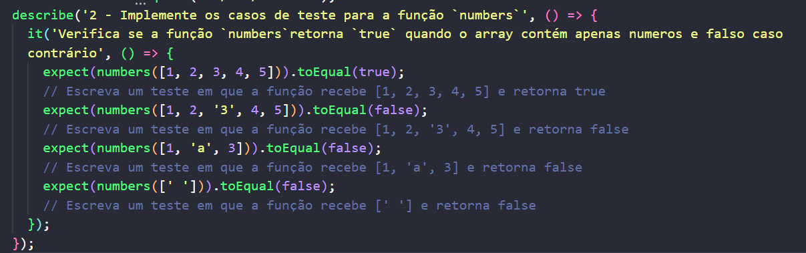

<></>

<h1>Projeto JS Testes Unitários</h1>

<h3>Oque foi desenvolvido:</h3>

<ul>
  <li>Desenvolvimento de testes unitários utilizando a biblioteca Jest</li>
  <li>Organização de código</li>
</ul>

Projeto desenvolvido em: 24/11/2022
